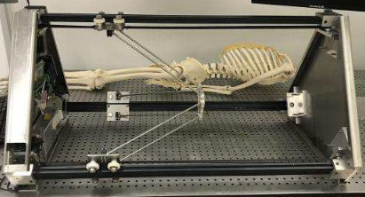
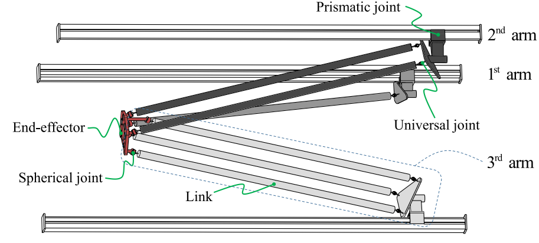
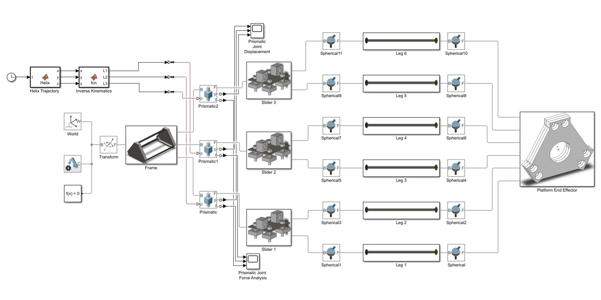
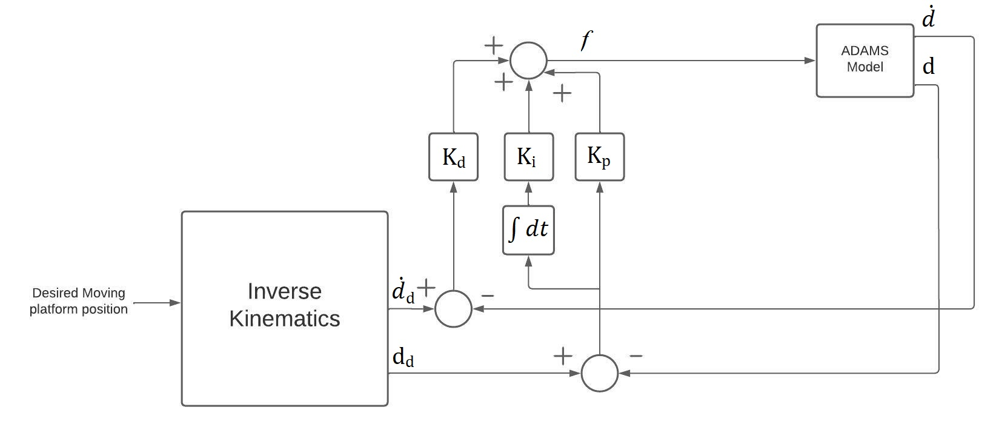

# Parallel Robotic Manipulator
A robot manipulator that can be used for medical applications, but we specified in the project that it is to be used for drug delivery

# How it works
- The robotic manipulator holds an omni-magnet at its end-effector
- A small magnetic drug-carrier robot is inserted in the blood vessel
- The manipulator moves which moves the small robot inside the blood vessel

# Illustration and setup

# Design

# Control Loop

# Simulation

